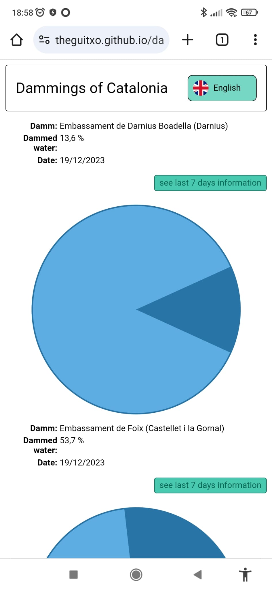

# Information about dammings of Catalonia

This is an app that show information about the water dammed in Catalonia's damms.

It's made with Angular (version 18) with standalone components (updated from Angular v17 with modules). The data are managed by a own service and the graphs are generated with SVG graphics.

The data of the dammings are provided by the Generalitat de Catalunya. More info in this url:

[https://analisi.transparenciacatalunya.cat/Medi-Ambient/Quantitat-d-aigua-als-embassaments-de-les-Conques-/gn9e-3qhr/about_data](https://analisi.transparenciacatalunya.cat/Medi-Ambient/Quantitat-d-aigua-als-embassaments-de-les-Conques-/gn9e-3qhr/about_data)

## App run

* Clone the repository:

``` git clone https://github.com/theguitxo/dammings.git ```

* Move to the project folder:

``` cd dammings ```

* Run the dev server:

``` npm run start ```

* Navigate to: **http://localhost:4200**

## Demo

You can see a demo of this app here:

[https://theguitxo.github.io/dammings/](https://theguitxo.github.io/dammings/)

[https://dammings.vercel.app/](https://dammings.vercel.app/)

## Screenshots

### Desktop


### Mobile



